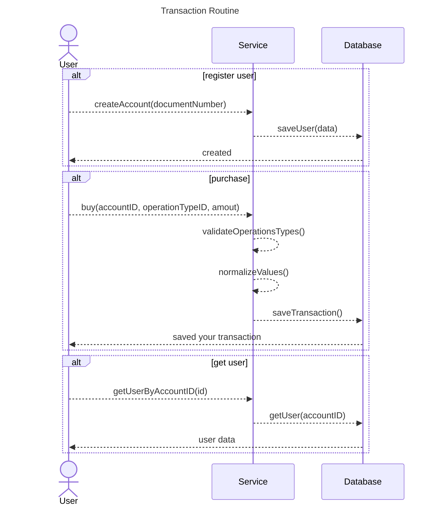

# transaction-routine
This project is a challenge to analyze my code skills at the moment.

## Driagram

```mermaid
sequenceDiagram 
  title Transaction Routine
  
  actor User
  
  alt register user
  User-->>Service:createAccount(documentNumber);
  Service-->>Database: saveUser(data);
  Database-->>User: created;
  end
  
  alt purchase
  User-->>Service:buy(accountID, operationTypeID, amout);
  Service-->>Service: validateOperationsTypes();
  Service-->>Service: normalizeValues();
  Service-->>Database: saveTransaction();
  Database-->>User: saved your transaction;
  end
  
  alt get user
  User-->>Service:getUserByAccountID(id);
  Service-->>Database: getUser(accountID);
  Database-->>User: user data;
  end
```

