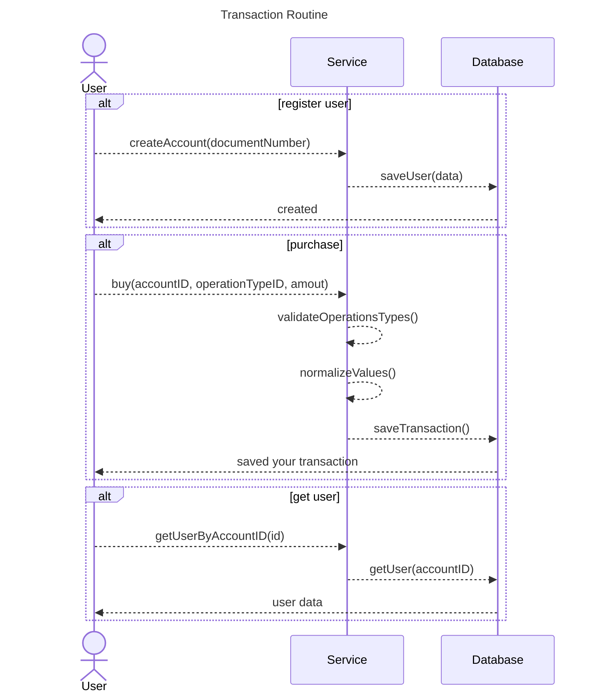

# transaction-routine
This project is a challenge to analyze my code skills at the moment.

## About
This project was developed to solve a job interview problem. In summary, it is a ledger where we have records of transactions made, just like a bank statement. Some tools were used to assist in the development, thus allowing us to focus on the business rule itself. Further down, we'll be able to see a sequence diagram to better understand these rules and also how to execute and run this application.

## How to run it
```bash
# Install dependecies
$ go install github.com/golang-migrate/migrate/v4/cmd/migrate@latest
$ go install github.com/sqlc-dev/sqlc/cmd/sqlc@latest
$ go install github.com/ServiceWeaver/weaver/cmd/weaver@latest
$ go install github.com/renanbastos93/boneless/cmd/boneless@latest

# Up database
$ docker-compose up

# Run migrations
$ boneless migrate app up

# Run server
$ boneless run

# For execute unit tests
$ make test
# output in last line: 
# total:                                                                          (statements)            64.7%
```

## Driagram

<!-- 


 -->
